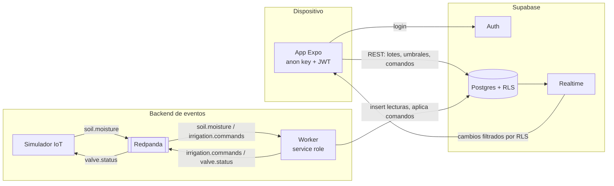
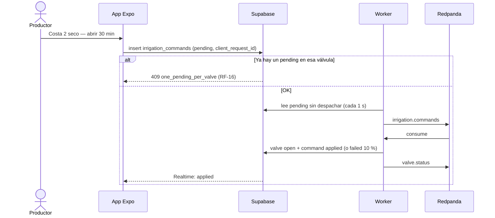

# AgroPulse — Informe del trabajo práctico

**Licenciatura en Sistemas de Información · Desarrollo y Arquitectura en Aplicaciones Móviles · 2026**
**Trabajo individual:** `<Nombre y apellido>`
**Repositorio:** https://github.com/candelarojas1/AgroPulse

> Los datos de humedad, clima y ubicación de este trabajo son **ficticios** (RNF-10): las lecturas las genera un simulador y las coordenadas de los lotes son aproximadas a la zona de Concordia y Federal (Entre Ríos), sin corresponder a un predio real.

---

## 1. Objetivo y alcance

AgroPulse es una demo de agricultura de precisión: el productor ve sus lotes en un mapa con un **semáforo de humedad**, entra al detalle de un lote (última lectura, gráfico de 6 h, umbral, válvulas) y **ordena riego** con acuse del comando.

El objetivo de aprendizaje es integrar una app móvil con un **backend BaaS** (Supabase) y un **flujo event-driven** (Redpanda/Kafka), distinguiendo con claridad la frontera **dispositivo ↔ API/Realtime ↔ broker**.

Se implementaron todos los requisitos **Must** de las tablas del PRD (RF-01 a RF-06, RF-08 a RF-16, RF-23, RF-24) y los RNF obligatorios (RNF-01 a RNF-06 y RNF-10). De los Should se incluyeron el paso de comandos por el topic `irrigation.commands` y el historial de comandos (RF-18). El resto de los Should (lectura manual offline, alertas, cancelación de comandos, campaña agrícola) quedó fuera de alcance.

## 2. Arquitectura

| Componente | Responsabilidad | Credenciales |
|---|---|---|
| **App** (Expo SDK 57, TypeScript strict, Expo Router) | UI, GPS, comandos | anon key + JWT del usuario |
| **Supabase** | Fuente de verdad: Auth, Postgres con RLS, Realtime | — |
| **Redpanda** | Bus de eventos (compatible con Kafka) | — |
| **Simulador** | Genera ticks con ruido (3–8 s por estación); puede "apagar" estaciones | **ninguna** de Supabase |
| **Worker** | Traduce eventos a SQL y aplica comandos | service role (solo en el backend) |

**Las tres fronteras:**

1. **Dispositivo ↔ Supabase.** La app solo usa la *anon key*. Todo lo que puede leer o escribir lo decide RLS según el JWT del usuario. Los cambios le llegan por Realtime, también filtrados por RLS.
2. **Supabase ↔ Worker.** El worker es el único proceso con la *service role key* y el único que escribe lecturas y estados de válvula.
3. **Worker ↔ Broker.** Solo el backend conoce Redpanda. El simulador hace de "hardware": publica en Kafka y no tiene acceso a la base.

### 2.1 Por qué el móvil no usa Kafka

| Motivo | Explicación |
|---|---|
| **Red móvil** | Kafka mantiene conexiones TCP largas y estables con el broker. En el campo la señal se corta y cambia de antena; HTTP + WebSocket de Supabase toleran mucho mejor esas reconexiones. |
| **Autenticación** | Kafka no entiende los usuarios de Supabase. Exponer el broker a internet obligaría a gestionar credenciales por dispositivo; con Supabase el permiso lo resuelve RLS con el JWT que la app ya tiene. |
| **Backpressure** | El topic tiene los ticks de todas las estaciones. Un celular no puede (ni debe) consumir ese volumen: necesita solo lo de sus establecimientos, ya filtrado. |
| **Esquema** | Si cambia el formato de un evento, las apps instaladas (que no se actualizan al instante) se romperían. El worker absorbe el cambio en un solo lugar y la app sigue leyendo tablas estables. |
| **Operación** | No hay un cliente Kafka mantenido para React Native, y abrir el broker a internet suma seguridad, monitoreo y costos que no aportan valor al usuario. |

En producción, como dice el PRD, el bus suele estar detrás de un concentrador LoRa/4G, nunca en el teléfono del productor.

## 3. Modelo de datos y seguridad (RLS)

Tablas (nombres en inglés en SQL, etiquetas en español en la UI): `organizations`, `memberships` (rol por establecimiento: `producer`, `operator`, `advisor`), `plots` (polígono GeoJSON y umbrales con default 25/45), `stations`, `readings`, `valves` e `irrigation_commands`.

**`memberships` define el perímetro.** Todas las políticas preguntan "¿el usuario tiene una membresía en el establecimiento dueño de esta fila?".

| Acción | Productor | Operador | Asesor | Worker |
|---|---|---|---|---|
| Ver lotes, lecturas, válvulas, comandos | ✅ | ✅ | ✅ | ✅ (service role) |
| Editar umbrales | ✅ | ❌ | ❌ | — |
| Crear comandos de riego | ✅ | ✅ | ❌ (403) | — |
| Insertar lecturas / cambiar válvulas | ❌ | ❌ | ❌ | ✅ |

La política de insert de comandos exige además: `status = 'pending'`, `requested_by = auth.uid()`, que el email del actor coincida con el del JWT (no se puede falsificar) y que la válvula pertenezca a un establecimiento donde el usuario sea productor u operador.

**Las reglas de negocio de los comandos también viven en la base**, no en la app:

| Regla | Mecanismo |
|---|---|
| Un solo comando `pending` por válvula (RF-16) | Índice único parcial `one_pending_per_valve` sobre `(valve_id) WHERE status = 'pending'` |
| Idempotencia del `client_request_id` (§8) | Restricción `UNIQUE` `irrigation_commands_client_request_id_key` |
| Duración entre 1 y 120 min | `CHECK` |

Así, aunque alguien modificara la app o mandara pedidos a mano, Postgres rechaza lo indebido. El botón deshabilitado del asesor es solo una ayuda visual; la seguridad real es RLS. Las reglas se verificaron con un script que inicia sesión como cada usuario de prueba (21 casos, todos correctos).

**Vistas.** `plot_overview` devuelve cada lote con su última lectura en una sola consulta (mapa rápido, RNF-03). `moisture_last_6h` agrupa la humedad en promedios de 5 minutos: con ticks cada pocos segundos, 6 h son miles de lecturas (y la API devuelve como máximo 1000 filas), agrupadas son ≤ 72 puntos. Ambas usan `security_invoker = true` para respetar RLS.

**Decisión: sin PostGIS.** Los polígonos se guardan como GeoJSON (`jsonb`). El único cálculo geográfico, "¿estoy en el lote?" (RF-06), se hace en el celular con *ray casting*, así la ubicación del usuario nunca viaja al servidor.

## 4. Flujo event-driven

### 4.1 Telemetría (OA-4)

`Simulador → soil.moisture → Worker → insert en readings → Realtime → App`

El simulador hace tender cada estación a un valor base (Costa 1 ≈ 35 % óptimo, Costa 2 ≈ 18 % seco) y, si escucha en `valve.status` que la válvula del lote está abierta, sube la humedad. Si el `station_id` no existe, el worker lo loguea y lo descarta sin cortar el loop. La pantalla **Diagnóstico** mide el **lag aparente** (hora de llegada a la app − hora de medición): en las pruebas fue de **0,5–0,7 s** (RNF-04 pide ≤ 3 s).

### 4.2 Comandos asíncronos (OA-5)

- **Un comando es un pedido, no una acción.** La app crea la fila en `pending` y el worker la pasa a `applied` (o a `failed` con motivo `valve_timeout` en el 10 % de los casos, para mostrar el camino de error).
- **El pedido se guarda antes de viajar.** Si Kafka o el worker están caídos, el comando no se pierde: queda `pending` y se aplica cuando el worker vuelve (comprobado frenando el worker).
- **La app escucha el resultado por Realtime** filtrando por su `client_request_id`, desde antes de enviar el comando, así no se pierde la confirmación. Si en 10 s no hay respuesta, muestra *"Sin confirmación del sistema"* y corta el spinner (RNF-05).
- **"Abrir N minutos"**: el worker cierra la válvula sola cuando se cumple `applied_at + N min`. Para la demo, `DURATION_MINUTE_SECONDS` acelera el tiempo.
- Medido en pruebas: el comando pasa de `pending` a `applied` en **2–3,5 s** (el PRD pide ≤ 5 s).

## 5. App móvil

| Pantalla | Contenido |
|---|---|
| Login | Email, contraseña, error de Auth en español. Sesión persistente (AsyncStorage) |
| Mapa | Polígonos con color de estado, etiqueta con texto, leyenda, botón "mi ubicación" |
| Lotes | Lista con cultivo, humedad y semáforo |
| Detalle | Última lectura y antigüedad, gráfico de 6 h, umbral mínimo, válvulas con botón Regar |
| Confirmar comando | Resumen (lote, válvula, acción, `client_request_id`) y estado en vivo |
| Historial | Últimos 20 comandos: fecha, actor, resultado |
| Cuenta | Rol, selector de establecimiento, diagnóstico, logout |
| Diagnóstico | Usuario, establecimiento, último tick y lag aparente |

**Decisiones de la app:**

- **Rutas protegidas con `Stack.Protected`** (Expo Router): sin sesión solo existe el login; si el token vence y no se puede renovar (401), la app vuelve sola al login.
- **El semáforo se calcula en la app** (`src/lib/plotStatus.ts`) con la fórmula del §8 (stale → dry → wet → optimal). La razón: `stale` depende del reloj. Cuando un sensor deja de reportar **no llega ningún evento**, así que la app recalcula cada 30 s. El PRD permite calcularlo en la app con la fórmula documentada.
- **Accesibilidad:** cada estado tiene color, ícono y texto ("Seco / Óptimo / Húmedo / Sin datos").
- **Un solo contexto de lotes** (`PlotsContext`) con una consulta y una suscripción Realtime compartidas por mapa, lista y detalle: los tres muestran siempre lo mismo.
- **Pocas dependencias:** sin librerías de estado ni de gráficos; el gráfico es un componente propio con `react-native-svg`.
- **Estados de UI:** carga inicial, vacío, error de red con reintento y comando en vuelo.

## 6. Decisiones ante ambigüedades del PRD

| Tema | Lo que dice el PRD | Decisión |
|---|---|---|
| ¿El operador edita umbrales? | §5 no se lo permite; §9 (RLS) sí | **Solo el productor**: la tabla de actores es más específica sobre cada rol. |
| Rango de Must | "RF-01 a RF-12", pero las tablas marcan Must también RF-13–16, 23 y 24 | Se implementaron todos los Must de las tablas. |
| Comandos por Kafka | Opcional en §8 (Should), presente en el diagrama §18 | Se implementó, para que coincida con el diagrama. |
| "Abrir N minutos" | No dice qué pasa al terminar | El worker cierra la válvula automáticamente. |
| Rol asesor | Should en §4.2, pero H2 y las RLS (Must) lo necesitan | Solo lectura; sin comentarios. |
| Umbral editable | RF-11 menciona solo el mínimo | Solo el mínimo es editable; el máximo usa el default 45. |
| Lote con varias estaciones | No define cuál lectura usar | La más reciente entre sus estaciones. |
| `weather.tick` | Topic aparte para la lluvia | La lluvia viaja opcional en el mismo tick (RF-08 lo permite). |

## 7. Requisitos no funcionales

| RNF | Evidencia |
|---|---|
| 01 Stack | Expo SDK 57, TypeScript `strict`, Expo Router. |
| 02 Seguridad | La app solo usa la anon key; la service role está solo en el `.env` del backend. `grep` sobre el código de la app (`apps/agropulse/src`) no encuentra `service_role`. |
| 03 Mapa < 3 s | Una sola consulta a la vista `plot_overview` para todos los lotes. |
| 04 Tick ≤ 3 s | Lag aparente medido en Diagnóstico: 0,5–0,7 s. |
| 05 Errores | Fallo de comando, 401/403, error de red y falta de confirmación terminan siempre con un mensaje, nunca con un spinner infinito (timeout de 10 s). |
| 06 Repro | README con `.env.example`, `docker-compose.yml`, migraciones, semilla y usuarios de prueba. |
| 10 Datos | Aviso de datos ficticios en el README, en este informe, en el login y en Cuenta. |

## 8. Flujo H1 (capturas)

| 1. Mapa: Costa 2 en rojo | 2. Detalle: 17,6 % con umbral 25 % | 3. Confirmar "abrir 30 min" | 4. Válvula abierta por Realtime |
|---|---|---|---|
|  |  |  |  |

Diagnóstico con el lag aparente del último tick:

## 9. Limitaciones

- Los Should no implementados: lectura manual offline con cola local (RF-21, RNF-07), alertas in-app (RF-19/20), cancelación de comandos (RF-17), campaña agrícola y tests unitarios (RNF-08).
- La selección de establecimiento no se guarda entre sesiones: se abre el primero en orden alfabético.
- Si el worker se corta abruptamente (sin apagarse), Kafka tarda ~30–60 s en reasignar los mensajes; con un apagado normal arranca en 1 s.
- Se probó en el simulador de iOS; Android no se verificó.
