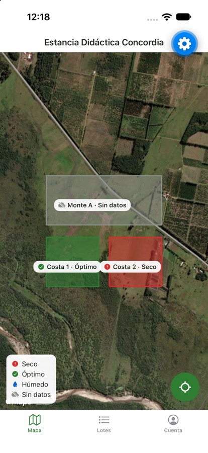
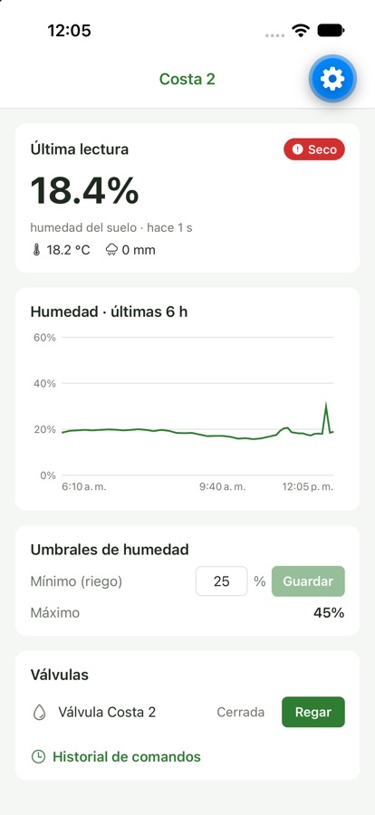
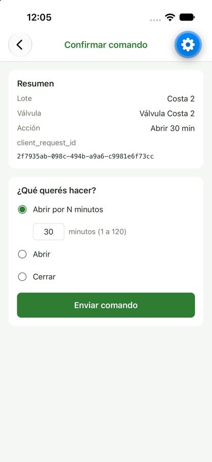
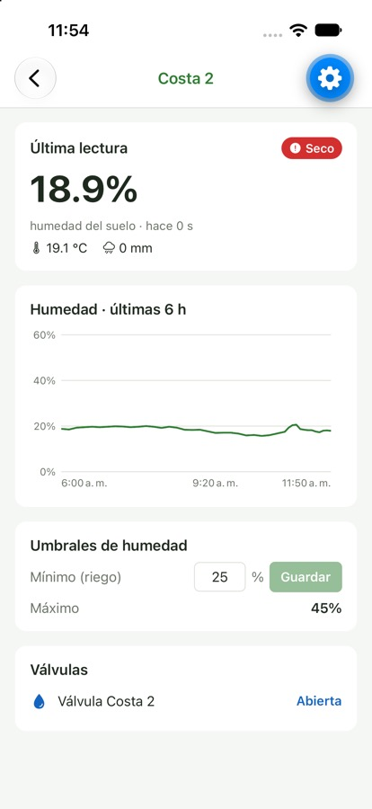
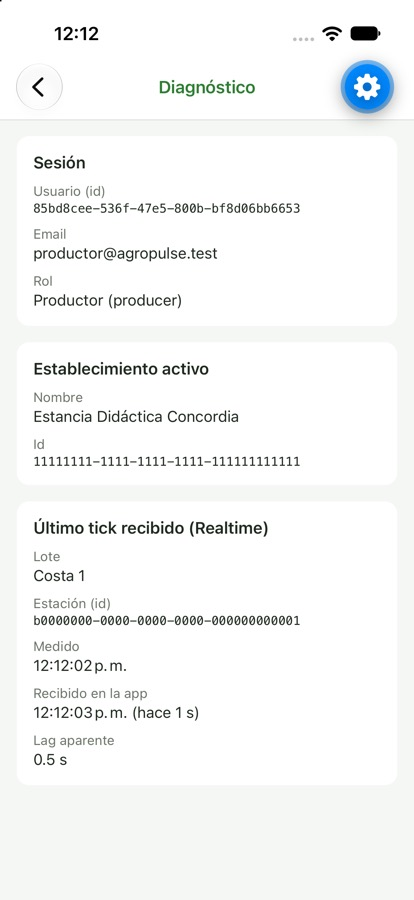

# AgroPulse — Informe

**Desarrollo y Arquitectura en Aplicaciones Móviles · 2026**
**Repositorio:** https://github.com/candelarojas1/AgroPulse

> Los datos de humedad, clima y ubicación son ficticios: los genera un simulador y los lotes no corresponden a un campo real.

## 1. Qué es

AgroPulse es una app que muestra los lotes de un campo en un mapa con un semáforo de humedad (seco, óptimo, húmedo o sin datos). Desde el detalle de cada lote se puede ver cómo evolucionó la humedad y mandar a regar.

## 2. Cómo está armado

```
 App  ──  Supabase  ──  Worker  ──  Redpanda (Kafka)  ──  Simulador de sensores
```

- **App:** muestra los datos y manda los pedidos de riego. Solo se conecta con Supabase.
- **Supabase:** guarda los datos, controla los permisos y avisa los cambios a la app en el momento.
- **Simulador:** hace de sensor y envía una lectura cada pocos segundos.
- **Worker:** recibe las lecturas, las guarda en Supabase y ejecuta los riegos.

## 3. Por qué el celular no usa Kafka

- En el campo la señal se corta, y Kafka necesita una conexión estable.
- Kafka no sabe qué usuario es cada uno, así que no puede controlar permisos.
- El celular recibiría los datos de todos los campos, cuando solo necesita los suyos.
- Si cambia el formato de los datos, habría que actualizar todas las apps instaladas.

## 4. Quién puede hacer qué

| Acción | Productor | Operador | Asesor |
|---|---|---|---|
| Ver lotes y lecturas | Sí | Sí | Sí |
| Cambiar el umbral de humedad | Sí | No | No |
| Mandar a regar | Sí | Sí | No |

Cada usuario ve solo los campos a los que pertenece. Estas reglas están en la base de datos y no en la app, así que se cumplen aunque alguien modifique la app.

## 5. Cómo funciona un riego

1. El usuario pide regar y el pedido queda **pendiente**.
2. El worker lo ejecuta en pocos segundos y lo marca como **aplicado**. A veces falla a propósito, para mostrar el caso de error.
3. La app se actualiza sola al recibir la respuesta.
4. Si en 10 segundos no hay respuesta, la app avisa "Sin confirmación" y deja de esperar.

No se puede mandar un segundo riego a una válvula que ya tiene uno pendiente.

## 6. Decisiones tomadas

| Situación | Decisión |
|---|---|
| El PRD no aclaraba si el operador puede cambiar umbrales | Solo lo hace el productor |
| No se indicaba qué pasa al terminar "regar N minutos" | La válvula se cierra sola |
| Un sensor que deja de enviar datos no avisa | La app revisa cada 30 segundos y marca el lote como "sin datos" |

## 7. Flujo H1

El productor ve Costa 2 en rojo, entra al detalle, manda a regar 30 minutos y la válvula queda abierta.

| Mapa | Detalle | Confirmar | Válvula abierta |
|---|---|---|---|
|  |  |  |  |

## 8. Datos en vivo

La pantalla Diagnóstico muestra la última lectura recibida y cuánto tardó en llegar a la app: menos de 1 segundo desde que el sensor la midió.



## 9. Pendiente

No se implementaron la carga manual sin conexión ni las alertas (son opcionales en el PRD).
